# ODLM（Ontology for Data Lake Management）构建与应用最佳实践

## 概要

本最佳实践通过构建基于 ODLM 本体的语义数据治理系统，验证本体驱动的数据血缘自动发现与智能分析能力。采用 Neo4j、MySQL、Milvus 三库融合架构，以运营商行业场景为例，实现从本体建模、数据映射到自然语言查询的端到端数据治理流程。通过智能Agent验证系统能够准确理解业务查询意图，自动推导多层级数据血缘关系，并提供可视化的血缘分析结果，为企业级语义数据治理提供可落地的技术方案。

---

## 1. 命名空间与版本

- 本体 IRI: `http://asiainfo.com/odlm`
- 命名空间（base IRI）: `http://asiainfo.com/odlm#`
- 版本: 1.0（与 `odlm.ttl` 保持一致）
- 标准对齐: 复用 DCAT（数据集与服务）、PROV-O（生成、使用、活动）、Dublin Core（通用元数据）

前缀建议：
```
@prefix rdf: <http://www.w3.org/1999/02/22-rdf-syntax-ns#> .
@prefix rdfs: <http://www.w3.org/2000/01/rdf-schema#> .
@prefix owl: <http://www.w3.org/2002/07/owl#> .
@prefix xsd: <http://www.w3.org/2001/XMLSchema#> .
@prefix dcat: <http://www.w3.org/ns/dcat#> .
@prefix prov: <http://www.w3.org/ns/prov#> .
@prefix dcterms: <http://purl.org/dc/terms/> .
@prefix odlm: <http://asiainfo.com/odlm#> .
@prefix ex:    <http://asiainfo.com/odlm-instances#> .
```

---

## 2. 概览与定位

ODLM 致力于以统一的语义框架描述数据源、表/字段、任务、指标、维度、标准、权限与服务，以及它们之间的依赖与血缘关系。其目标是：
- 显式化结构化数据的业务含义与治理元数据，降低跨系统理解与集成成本；
- 用属性链与传递性推理表达血缘依赖，支持自动化溯源与影响分析；
- 为智能体（Agent）与知识检索提供结构化、可推理的知识基座；
- 与现有数据治理体系（DCAT、PROV、Dublin Core）无缝衔接。

---

## 3. 设计原则

- 复用标准：优先复用 DCAT/PROV-O/Dublin Core，以增强互操作性；
- 轻量约束：Domain/Range 采用“必要即声明”的策略，避免过度限制；
- 明确标识：实体具备稳定、可交流的业务标识（如 `tableId`/`fieldId`）；
- 枚举外置：更新周期、层级、统计周期等以词表/命名个体表达；
- 可推导性：在 Neo4j 中以节点—关系—路径的多跳模式进行链式推导；TTL 中声明的传递/链语义在实现层通过关系与查询模板实现；
- 可扩展性：允许场景化扩展（如对象建模 `odlm:Object` 与 `odlm:ObjectField`），保持核心架构的简洁性。

### 3.1 Neo4j 概念-类-实例分层与属性继承

- 顶层概念（Concept）：`Agent`、`Activity`、`Entity`、`Class`。
  - `Agent`：代表具有行动能力的实体，如用户、团队、工作空间等。
  - `Activity`：系统中被动/主动触发的任务单元，具备输入与输出（均为 `Entity`）。
  - `Entity`：数据系统中的核心要素，承载状态性属性。
  - `Class`：Concept 的具体化层，系统创建的所有实例（Instance）均隶属于某个 `Class`（如 `User` 为 `Agent` 概念的一个具体类）。
- 属性（Property）继承：父级 Concept 定义的属性由其子级 Class 继承；Class 可继续细化自身属性。
- 关系（Relationship）类别：
  - 对象属性（ObjectProperty）：`Instance -> Instance`，表达实体间语义关系（如 `User creates Task`）。
  - 数据属性（DataProperty）：`Instance -> Literal`，表达并约束实例属性数据类型（如 `hasDueDate: xsd:dateTime`）。

该分层架构有助于在 Neo4j 中以属性图方式实现 ODLM 设计：概念稳定、类型清晰、实例轻量，便于推理与可视化。

### 3.2 三库融合架构与职责边界

- 关系型数据库（RDBMS）：存储本体对象映射的具体业务数据与系统运行所需核心业务数据，作为真实数据的最终落地；
- Neo4j 图数据库：存储与管理本体结构（类、属性、关系）及其语义连接，不存放大规模业务事实数据；
- 向量数据库（Vector DB）：缓解用户自然语言与本体规范术语间的语义鸿沟，提供相似度检索以定位最相关的概念/实例。

工作流要点：
- 通过本体对象（`odlm:Object`/`odlm:ObjectField`）将语义视图映射至物理表/字段；
- 在执行数据查询时，由图谱解析映射关系，转向 RDBMS 执行 SQL；
- 面向自然语言查询先经向量库进行语义对齐，再返回 Neo4j 精确定位，最后在 RDBMS 中提取事实数据；
- 逻辑解耦、专业分工，避免单一数据库承担其不擅长的负载而造成性能瓶颈。

---

## 4. 快速开始

以下示例采用最小可运行路径演示 ODLM 的实施过程：启动基础环境 → 配置应用 → 初始化图结构/数据库 → 通过 TTL 与 Python API 创建示例数据。示例严格遵循 `odlm` 已定义的类与属性规范。

在 `docs.zip` 压缩包中，包含以下关键内容：
- `code` 文件夹：存放运行测试所需的必要脚本和依赖项
- `example.ttl`：样例数据的 OWL 定义，包括测试表、字段、本体对象和对象属性
- `ODLM_BestPractice.md`：最佳实践文档
- `ODLM_Vocabulary.md`：词汇表文档
- `odlm.ttl`：ODLM的ttl构建文档

`code` 文件夹下的文件包括：

| 文件名 | 功能描述 |
|--------|----------|
| `auto_agent.py` | 测试Agent的代码，可以调用工具进行快速验证 |
| `example.py` | 样例数据导入脚本 |
| `graph_init.py` | Neo4j初始化脚本 |
| `mysql_init.py` | MySQL初始化脚本 |
| `tools.py` | 测试Agent所使用的工具定义代码 |
| `pyproject.toml` | 测试Agent所使用的工具定义代码 |
| `config.development.example.yaml` | 配置文件模板 |

`code/core` 文件夹中包含测试脚本所依赖的核心代码库，无需额外关注。

### 4.1 环境准备（Linux）

#### Docker环境准备

配置 Docker 的 APT 仓库，请在终端中执行以下命令：
```bash
# Add Docker's official GPG key:
sudo apt-get update
sudo apt-get install ca-certificates curl
sudo install -m 0755 -d /etc/apt/keyrings
sudo curl -fsSL https://download.docker.com/linux/ubuntu/gpg -o /etc/apt/keyrings/docker.asc
sudo chmod a+r /etc/apt/keyrings/docker.asc

# Add the repository to Apt sources:
echo \
  "deb [arch=$(dpkg --print-architecture) signed-by=/etc/apt/keyrings/docker.asc] https://download.docker.com/linux/ubuntu \
  $(. /etc/os-release && echo "${UBUNTU_CODENAME:-$VERSION_CODENAME}") stable" | \
  sudo tee /etc/apt/sources.list.d/docker.list > /dev/null
sudo apt-get update
```

随后执行以下命令：

```bash
sudo apt-get install docker-ce docker-ce-cli containerd.io docker-buildx-plugin docker-compose-plugin
```

执行以下命令验证安装是否完成：
```bash
docker images
```


接下来安装 Docker Compose 插件，用于后续一键启动所需服务。在终端中执行以下命令：
```bash
sudo apt-get update
sudo apt-get install docker-compose-plugin
```

执行以下命令验证安装是否成功：
```bash
docker compose version
```


接下来，创建一个名为 `odlm_test` 的项目目录。


#### Neo4j 数据库
使用 Docker Compose 启动 Neo4j（示例基于 Neo4j 5.23.0）：

在刚创建的 `odlm_test` 文件夹中，创建一个 `neo4j` 文件夹。

```bash
cd odlm_test
mkdir neo4j
cd neo4j
```


在该文件夹内，创建一个 `docker-compose.yml` 文件：

```bash
# 如果vim没有安装，则先安装vim
# sudo apt-get update
# sudo apt-get install vim
vim docker-compose.yml
```

将以下内容复制到文件中：
```yml
services:
  neo4j:
    image: neo4j:5.23.0 # 根据需求替换为其他版本的镜像
    container_name: neo4j
    ports:
      - "7474:7474"  # Neo4j 浏览器访问端口
      - "7687:7687"  # Bolt 协议端口
    volumes:
      - "./data:/data"  # 持久化数据卷
      - "./logs:/logs"  # 持久化日志卷
      - "./import:/import"  # 持久化导入数据卷
      - "./plugins:/plugins"  # 持久化插件卷
      - "./conf:/conf"  # 持久化配置卷
    environment:
      - NEO4J_AUTH=neo4j/123456  # 设置默认的用户名和密码
      - NEO4J_apoc_export_file_enabled=true
      - NEO4J_apoc_import_file_enabled=true
      - NEO4J_apoc_import_file_use__neo4j__config=true
      - NEO4J_dbms_security_procedures_unrestricted=apoc.*,genai.*
      - NEO4J_PLUGINS=["apoc", "n10s"]
    restart: unless-stopped
```

使用 `:wq` 命令保存文件并退出。

执行以下命令启动 Neo4j 服务：
```bash
docker compose up -d
```


启动完成后，在浏览器中访问 http://localhost:7474 即可进入 Neo4j 管理界面。

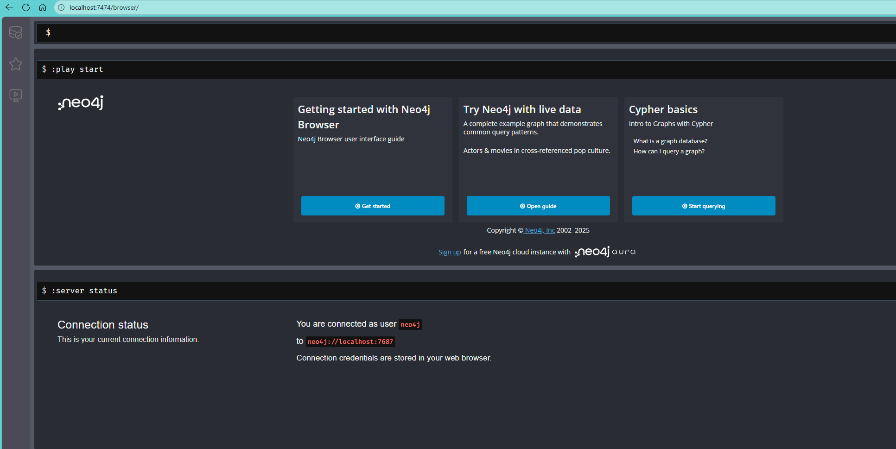

若需关闭服务，请返回该文件夹并在终端中执行以下命令：
```bash
docker compose down
```

#### MySQL 数据库
使用 Docker Compose 启动 MySQL：

返回 `odlm_test` 文件夹，创建一个 `mysql` 文件夹。

```bash
mkdir mysql
cd mysql
```

与 Neo4j 相同，创建一个 `docker-compose.yml` 文件并将以下内容复制到文件中：
```bash
vim docker-compose.yml
```
```yml
services:
  mysql8:
    image: mysql:8.0
    container_name: mysql8
    ports:
      - "3306:3306"
    volumes:
      - "./data:/var/lib/mysql"
    environment:
      - MYSQL_ROOT_PASSWORD=123456
    command: mysqld
```
使用 `:wq` 命令保存文件并退出。

同样执行以下命令启动 MySQL 服务：

```bash
docker compose up -d
```


若需关闭服务，请返回该文件夹并在终端中执行以下命令：

```bash
docker compose down
```

#### Milvus向量库
使用Docker Compose启动向量库:

返回 `odlm_test` 文件夹，创建一个 `milvus` 文件夹。

```bash
mkdir milvus
cd milvus
```

与 Neo4j 相同，创建一个 `docker-compose.yml` 文件并将以下内容复制到文件中：

```bash
vim docker-compose.yml
```

```yml
services:
  etcd:
    container_name: milvus-etcd
    image: quay.io/coreos/etcd:v3.5.18
    environment:
      - ETCD_AUTO_COMPACTION_MODE=revision
      - ETCD_AUTO_COMPACTION_RETENTION=1000
      - ETCD_QUOTA_BACKEND_BYTES=4294967296
      - ETCD_SNAPSHOT_COUNT=50000
    volumes:
      - "./volumes/etcd:/etcd"
    command: etcd -advertise-client-urls=http://etcd:2400 -listen-client-urls http://0.0.0.0:2400 --data-dir /etcd
    healthcheck:
      test: ["CMD", "etcdctl", "endpoint", "health"]
      interval: 30s
      timeout: 20s
      retries: 3

  minio:
    container_name: milvus-minio
    image: minio/minio:RELEASE.2024-12-18T13-15-44Z
    environment:
      MINIO_ACCESS_KEY: minioadmin
      MINIO_SECRET_KEY: minioadmin
    ports:
      - "9001:9001"
      - "9000:9000"
    volumes:
      - "./volumes/minio:/minio_data"
    command: minio server /minio_data --console-address ":9001"
    healthcheck:
      test: ["CMD", "curl", "-f", "http://localhost:9000/minio/health/live"]
      interval: 30s
      timeout: 20s
      retries: 3

  standalone:
    container_name: milvus-standalone
    image: milvusdb/milvus:v2.6.0
    command: ["milvus", "run", "standalone"]
    security_opt:
    - seccomp:unconfined
    environment:
      ETCD_ENDPOINTS: etcd:2400
      MINIO_ADDRESS: minio:9000
      MQ_TYPE: woodpecker
    volumes:
      - "./milvus:/var/lib/milvus"
    healthcheck:
      test: ["CMD", "curl", "-f", "http://localhost:9091/healthz"]
      interval: 30s
      start_period: 90s
      timeout: 20s
      retries: 3
    ports:
      - "19530:19530"
      - "9091:9091"
    depends_on:
      - "etcd"
      - "minio"

networks:
  default:
    name: milvus
```

使用 `:wq` 命令保存文件并退出。

同样执行以下命令启动 Milvus 服务：
```bash
docker compose up -d
```

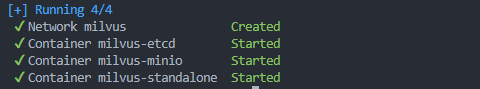


若需关闭服务，请返回该文件夹并在终端中执行以下命令：
```bash
docker compose down
```

#### Python 环境

安装 Python 3.12+，在终端中执行以下命令：
```bash
sudo add-apt-repository ppa:deadsnakes/ppa
sudo apt update
```

```bash
sudo apt install python3.12
```

安装完成后，执行以下命令验证安装结果：
```bash
python3.12 --version
```


返回 `odlm_test` 文件夹，创建一个 `code` 文件夹，用于存放最佳实践所需的代码文件。

```bash
mkdir code
```

将 `docs.tar.gz` 压缩包中 `code` 文件夹的内容解压到新创建的 `code` 文件夹中。
```bash
# 显示你目前的路径
pwd
# /home/user/asiainfo/odlm_test
tar -xzvf docs.tar.gz --strip-components=1 -C /home/user/asiainfo/odlm_test/code 'code/'
```

代码解压完成后，使用 Poetry 初始化并安装python环境依赖：

打开命令行，输入命令来安装poetry

```bash
curl -sSL https://install.python-poetry.org | python3 -
```

等待安装完成后，在命令行中输入，检查安装是否成功

```bash
poetry --version

# 输出样例
# Poetry (version 1.8.2)
```

安装shell插件

```bash
poetry self add poetry-plugin-shell
```

前往你刚刚新建的``code``文件夹，然后打开terminal执行命令来安装依赖

```bash
# 假设你在odlm_test文件夹内
cd code
poetry shell
poetry install
```

Python 环境配置完成。

### 4.2 应用配置
参考 `code/config` 目录下的 `config.development.example.yaml` 配置文件进行配置
```yaml
# 应用的启动环境，保持不动即可
app:
  environment: development
# 应用的启动端口，保持不动即可
server:
  port: 8000
  reload: true
  debug: true
databases:
# mysql连接配置，配置内容与你启动mysql时一致
  mysql:
    host: localhost
    port: 3306
    user: root
    password: 123456
    database: test_db
# neo4j连接配置，配置内容与你启动neo4j时一致
  neo4j:
    host: localhost
    port: 7687
    user: neo4j
    password: 123456
    database: neo4j
# milvus连接配置，配置内容与你启动milvus时一致
  milvus:
    uri: "http://localhost:19530"
    db_name: "ontology"
# AI相关配置，按需进行替换，需要开通对应的LLM和Embedding服务
ai_services:
  default_llm: openai
  default_embedding: local
  llm:
    openai:
      name: openai
      api_key: sk-your-dev-key
      model: gpt-4o
  embedding:
    local:
      name: sentence-transformers
      host: http://127.0.0.1:8000
      model: all-MiniLM-L6-v2
```

为了生成配置文件，请进入 `code` 文件夹，再进入 `config` 文件夹，在终端中执行以下命令：

```bash
mv config.development.example.yaml config.development.yaml
```

这将创建一个新的配置文件。请打开 `config.development.yaml` 文件，将上述配置信息复制并覆盖原有内容，然后根据实际情况进行修改。

返回 `code` 文件夹，在终端中执行以下命令启动应用（用于验证依赖是否正确）：
```bash
# 如果该打开的terminal未运行过poetry shell，则先运行poetry shell来开启环境
python app.py
```

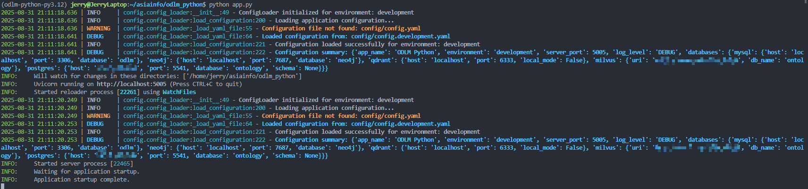

### 4.3 启动与初始化
在 `code` 文件夹内打开终端。
#### 初始化 Neo4j 图结构
执行脚本构建系统图结构，包含所有 Concept、Class、ObjectProperty 和 DataProperty 节点。
```bash
# 如果该打开的terminal未运行过poetry shell，则先运行poetry shell来开启环境
python graph_init.py

# 输出
# 已完成neo4j初始化
```

登录 Neo4j Browser（`http://localhost:7474`）验证是否已创建基础结构。
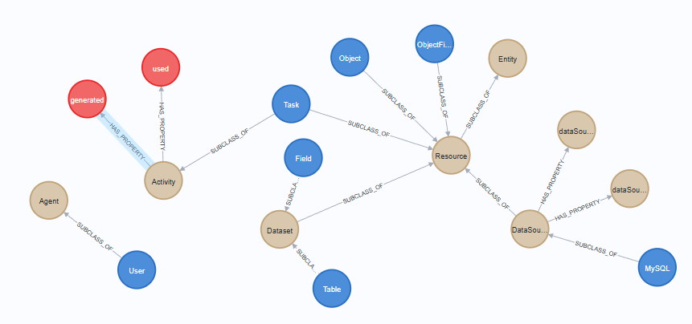

#### 初始化测试用 MySQL 表

在终端中执行以下脚本：
```bash
# 如果该打开的terminal未运行过poetry shell，则先运行poetry shell来开启环境
python mysql_init.py

# 输出
# 已完成mysql初始化
```
初始化 MySQL 并添加测试表与数据。该脚本将在 MySQL 中创建一个名为 `test_db` 的测试数据库，其中包含四张测试表及其样例数据。

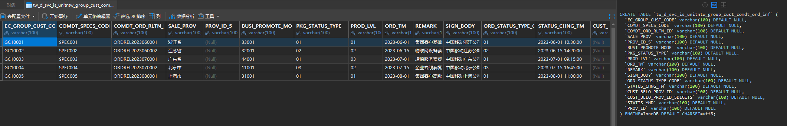
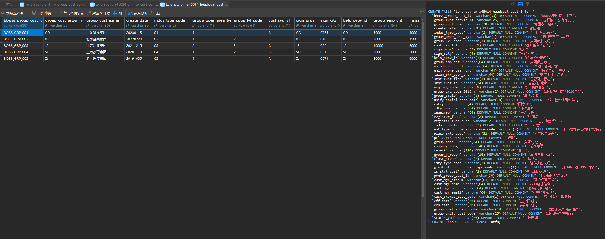
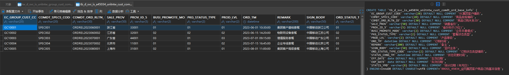
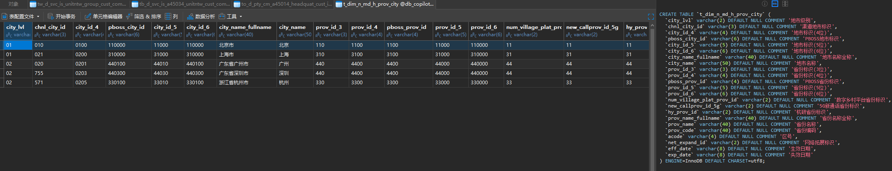

#### 初始化测试用 Milvus 库

在终端中执行以下脚本：
```bash
# 如果该打开的terminal未运行过poetry shell，则先运行poetry shell来开启环境
python milvus_init.py

# 输出
# 已完成milvus初始化
```

该脚本将在 Milvus 中创建测试所需的数据库、集合和模式。

---

### 4.4 运行示例

#### 方案一： 通过 TTL 注册本体实例（敬请期待）

#### 方案二： 通过 Python API 注册本体实例

在 `code` 文件夹中，打开终端并执行以下脚本：
```bash
# 先运行poetry shell，如果之前当前打开的terminal没有运行过的话，用于打开python环境
# poetry shell
python example.py

# 输出
# 样例数据已添加至neo4j图谱中
```

图谱中将新增节点与关系，可在 Neo4j Browser 中进行可视化查看。请访问 http://localhost:7474 进行查看。

在浏览器的查询编辑器中输入以下内容，然后点击执行按钮查询特定本体节点：
```cypher
MATCH (n:Instance {name:"<obj-001>全网集团客户商品订购信息"}) RETURN n
```

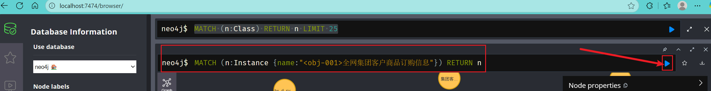

双击显示的节点进行展开，然后可以根据需要点击不同节点进行探索。

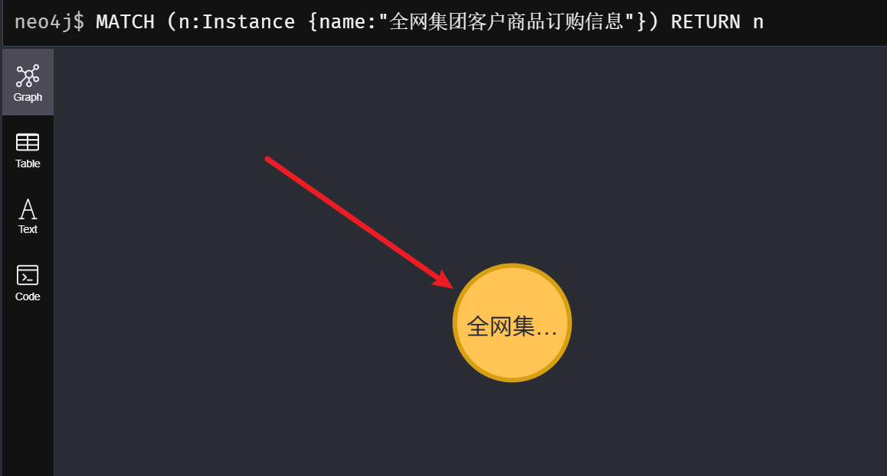

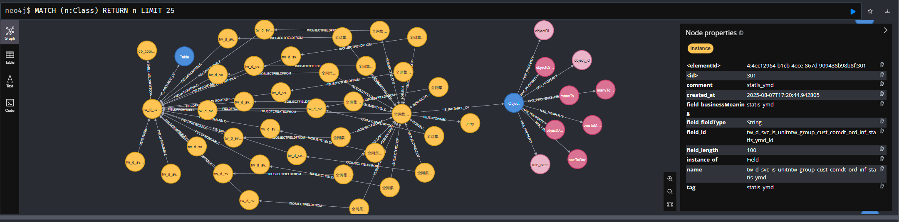

图谱中将新增一个名为“全网集团客户商品订购信息”的本体对象，以及该本体的相关属性（如“商品规格编号”、“EC集团客户编码”等）。同时创建该本体所映射的源表、字段，以及生成源表的任务及其所使用的表。这些数据将用于后续测试中的血缘分析流程验证。

#### 使用 Agent 快速验证（可选，需要大模型服务和词嵌入服务）

为了便于快速上手，这里提供了一个可用于快速测试的 Agent，其包含三个可用工具：
- ``query_by_cypher``：通过cypher语句查询neo4j数据库，但是只能进行查询，禁止进行写入和删除操作。
- ``search_for_precise_node_name``：通过文本相似度检索的方式，搜索neo4j数据库中的节点名称。因为大多数时候用户输入的节点名称或是数据名称是模糊的，所以需要通过这种方式来先确定精确的节点名称然后再编写cypher语句。
- ``find_binding_data_of_object``：通过源表名和sql查询语句，查询关系型数据库中的存储的真实数据。

这些工具的定义可在 `code/tools.py` 中查看。

测试 Agent 基于大语言模型驱动，因此使用 Agent 需要配置相关的模型服务。同时需要词嵌入模型服务对用户查询进行向量化处理。

请编辑 `code/config/config.development.yaml` 文件，配置其中的模型服务和词嵌入服务：

```yaml
# AI相关配置，按需进行替换，需要开通对应的LLM和Embedding服务
ai_services:
  default_llm: openai
  default_embedding: local
  llm:
    openai:
      name: openai
      api_key: sk-your-dev-key
      model: gpt-4o
  embedding:
    local:
      name: sentence-transformers
      host: http://127.0.0.1:8000
      model: all-MiniLM-L6-v2
```

Agent 的提示词模板：
```txt
# 角色
你是一名数据分析专家，作为我们数据系统平台的智能助手，帮助用户解决所有关于数据分析的问题。

# 能力
你可以通过不同的工具来与不同的数据库进行交互。以下是你可以使用的工具：
query_by_cypher：通过cypher语句查询neo4j数据库，但是只能进行查询，禁止进行写入和删除操作。
search_for_precise_node_name：通过文本相似度检索的方式，搜索neo4j数据库中的节点名称。因为大多数时候用户输入的节点名称或是数据名称是模糊的，所以需要通过这种方式来先确定精确的节点名称然后再编写cypher语句。
find_binding_data_of_object：通过源表名和sql查询语句，查询关系型数据库中的存储的真实数据。

# 数据系统的背景
我们的数据系统是基于本体论构建出来的，所有的实例的label都是Instance，每一个实例都来自于某一个label为Class的本体节点。实例与实例之间也许会存在关系，
实例与实例之间的关系也有可能会出现推导/推理关系，比如某一张表的字段，可能来自于另一张表中的字段，那么这两张表也就会存在关系，但是这个关系属于隐性关系，
需要通过多轮的cypher查询来进行推理得出。

目前系统中，有以下Class：
- Task: 系统中的任务，比如ETL任务等，每一个任务实例都拥有对应的输入和输出
- Field: 表/数据模型中的字段
- Table: 表/数据模型
- MySQL: 数据源的其中一种
- User: 系统中的用户
- Object: 用户基于本体概念构建的对象，与系统中的某个表或数据模型进行绑定，用于查询真实数据
- ObjectField: 本体对象中的字段，与系统中的某个表或数据模型中的字段进行绑定，用于查询真实数据

Class下的实例之间有以下关系：
'Field' - [FIELDFROMTABLE] -> 'Table'
'Field' - [FIELDTRANSFORMEDFROM] -> 'Field'
'Table' - [TABLEBELONGSTODATASOURCE] -> 'MySQL'
'Task' - [USED] -> 'Table'
'Task' - [TASK_OWNER] -> 'User'
'Task' - [GENERATED] -> 'Table'
'ObjectField' - [ISOBJECTFIELDOF] -> 'Object'
'ObjectField' - [ISOBJECTFIELDFROM] -> 'Field'
'Object' - [OBJECTCREATEDFROM] -> 'Table' //本体对象绑定的哪个表

举个例子，如果我们要检索user表有哪些字段，那么查询语句可以这么写：
MATCH (t:Instance {{{{name: 'user'}}}})<-[:FIELDFROMTABLE]-(f:Instance) RETURN f.name SKIP 0 * 10 LIMIT 10
因为user是Table的实例，所以我们可以通过FIELDFROMTABLE关系来找到user表的所有字段。

可以通过每个节点属性中的instance_of属性来判断节点属于哪个Class。

你可以先查询一个节点有哪些属性，这样可以帮助你更好的理解节点可执行的操作。

# 你的任务
你需要基于用户请求，利用工具，逐步推导并检索出支撑解决用户需求的结果。也就是说，你需要调用工具，观察工具的结果，再规划下一步行动并再次调用工具。

这个流程也许会重复很多次，直到你认为你已经找到了足够的信息来支撑解决用户需求。

# 可供参考的任务流程
- 血缘分析
基于给定的目标数据，系统性的进行血缘分析，需要依序进行推理，一层一层的找到数据来源。

每找到一个目标节点后，需要根据节点的属性和关系，推理出下一个目标节点，直到找到最上层的instance节点。

# 开始！
```

接下来，使用 Agent 基于 ODLM 进行血缘分析测试验证。

在 `code` 文件夹中，创建一个 `agent_test.py` 文件，将以下代码复制到文件中并保存：

```python
from auto_agent import AutoAgent

auto_agent = AutoAgent()

# '全网集团客户商品订购信息都使用了哪些表, 并帮我分析这些表的血缘'为提问Agent的内容，可按需更换提问
res = await auto_agent.run("全网集团客户商品订购信息都使用了哪些表, 并帮我分析这些表的血缘")
```

在终端中执行以下命令运行该测试脚本：

```bash

# 如果该打开的terminal未运行过poetry shell，则先运行poetry shell来开启环境
python agent_test.py
```
将显示相应的 Agent 输出结果：

```text
2025-08-13 14:04:36.897 | INFO     | utils.databases.mysql.mysql_service:__init__:85 - MySQL service initialized for database: odlm at localhost:3306
2025-08-13 14:04:36.898 | INFO     | utils.databases.service_factory:create_mysql_service:65 - MySQL service created: MySQLService(host=localhost, database=odlm)
2025-08-13 14:04:36.919 | INFO     | utils.databases.mysql.mysql_service:_get_async_pool:95 - Async MySQL connection pool created successfully
2025-08-13 14:04:36.928 | DEBUG    | utils.databases.mysql.mysql_service:afetch_all:240 - Fetch all completed, rows: 2
2025-08-13 14:04:42.093 | INFO     | core.llm.agents.auto_agent:auto_search_agent:84 - task_context: 
            血缘分析
            基于给定的目标数据，系统性的进行血缘分析，需要依序进行推理，一层一层的找到数据来源。

每找到一个目标节点后，需要根据节点的属性和关系，推理出下一个目标节点，直到找到最上层的instance节点。
            
2025-08-13 14:04:47.744 | INFO     | core.llm.tools.neo4j_tools:search_for_precise_node_name:41 - search_for_precise_node_name node_name: 集团客户商品订购信息
2025-08-13 14:04:48.336 | INFO     | utils.databases.service_factory:create_qdrant_service:168 - Qdrant service created with local_mode=False
2025-08-13 14:04:49.626 | INFO     | core.llm.tools.neo4j_tools:search_for_precise_node_name:53 - search_for_precise_node_name result: ['name: 全网集团客户商品订购信息, is_instance_of: Object, labels: Instance', 'name: 集团个人业务订购信息_产品来源, is_instance_of: ObjectField, labels: Instance', 'name: 全网集团客户商品订购信息_订购时间, is_instance_of: ObjectField, labels: Instance', 'name: 全网集团客户商品订购信息_业务开展模式, is_instance_of: ObjectField, labels: Instance', 'name: 集团个人业务订购信息_集团客户标识, is_instance_of: ObjectField, labels: Instance']
2025-08-13 14:04:49.640 | INFO     | core.llm.agents.auto_agent:auto_search_agent:84 - task_context: 
            血缘分析
            基于给定的目标数据，系统性的进行血缘分析，需要依序进行推理，一层一层的找到数据来源。

每找到一个目标节点后，需要根据节点的属性和关系，推理出下一个目标节点，直到找到最上层的instance节点。
            
2025-08-13 14:04:57.848 | INFO     | utils.databases.neo4j.neo4j_service:__init__:86 - Neo4j service initialized for database: neo4j at bolt://localhost:7687
2025-08-13 14:04:57.850 | INFO     | utils.databases.service_factory:create_neo4j_service:117 - Neo4j service created: Neo4jService(uri=bolt://localhost:7687, database=neo4j)
2025-08-13 14:04:57.851 | INFO     | core.llm.tools.neo4j_tools:query_by_cypher:21 - query_by_cypher cypher: MATCH (o:Instance {name: '全网集团客户商品订购信息'})-[:OBJECTCREATEDFROM]->(t:Instance) RETURN t.name SKIP 0 * 10 LIMIT 10
2025-08-13 14:04:58.336 | DEBUG    | utils.databases.neo4j.neo4j_service:run_query:162 - Query executed successfully, returned 1 records
2025-08-13 14:04:58.336 | INFO     | core.llm.tools.neo4j_tools:query_by_cypher:24 - query_by_cypher result: [{'t.name': 'tw_d_svc_is_unitntw_group_cust_comdt_ord_inf'}]
2025-08-13 14:04:58.338 | INFO     | core.llm.agents.auto_agent:auto_search_agent:84 - task_context: 
            血缘分析
            基于给定的目标数据，系统性的进行血缘分析，需要依序进行推理，一层一层的找到数据来源。

每找到一个目标节点后，需要根据节点的属性和关系，推理出下一个目标节点，直到找到最上层的instance节点。
            
2025-08-13 14:05:05.262 | INFO     | utils.databases.neo4j.neo4j_service:__init__:86 - Neo4j service initialized for database: neo4j at bolt://localhost:7687
2025-08-13 14:05:05.263 | INFO     | utils.databases.service_factory:create_neo4j_service:117 - Neo4j service created: Neo4jService(uri=bolt://localhost:7687, database=neo4j)
2025-08-13 14:05:05.264 | INFO     | core.llm.tools.neo4j_tools:query_by_cypher:21 - query_by_cypher cypher: MATCH (t:Instance {name: 'tw_d_svc_is_unitntw_group_cust_comdt_ord_inf'})<-[:FIELDFROMTABLE]-(f:Instance) RETURN f.name SKIP 0 * 10 LIMIT 10
2025-08-13 14:05:05.632 | DEBUG    | utils.databases.neo4j.neo4j_service:run_query:162 - Query executed successfully, returned 10 records
2025-08-13 14:05:05.632 | INFO     | core.llm.tools.neo4j_tools:query_by_cypher:24 - query_by_cypher result: [{'f.name': 'tw_d_svc_is_unitntw_group_cust_comdt_ord_inf_prov_id'}, {'f.name': 'tw_d_svc_is_unitntw_group_cust_comdt_ord_inf_cust_belo_prov_id_5digits'}, {'f.name': 'tw_d_svc_is_unitntw_group_cust_comdt_ord_inf_cust_belo_prov_id'}, {'f.name': 'tw_d_svc_is_unitntw_group_cust_comdt_ord_inf_statis_ymd'}, {'f.name': 'tw_d_svc_is_unitntw_group_cust_comdt_ord_inf_status_chng_tm'}, {'f.name': 'tw_d_svc_is_unitntw_group_cust_comdt_ord_inf_ord_status_type_code'}, {'f.name': 'tw_d_svc_is_unitntw_group_cust_comdt_ord_inf_sign_body'}, {'f.name': 'tw_d_svc_is_unitntw_group_cust_comdt_ord_inf_remark'}, {'f.name': 'tw_d_svc_is_unitntw_group_cust_comdt_ord_inf_ord_tm'}, {'f.name': 'tw_d_svc_is_unitntw_group_cust_comdt_ord_inf_prod_lvl'}]
2025-08-13 14:05:05.634 | INFO     | core.llm.agents.auto_agent:auto_search_agent:84 - task_context: 
            血缘分析
            基于给定的目标数据，系统性的进行血缘分析，需要依序进行推理，一层一层的找到数据来源。

每找到一个目标节点后，需要根据节点的属性和关系，推理出下一个目标节点，直到找到最上层的instance节点。
            
2025-08-13 14:05:12.864 | INFO     | utils.databases.neo4j.neo4j_service:__init__:86 - Neo4j service initialized for database: neo4j at bolt://localhost:7687
2025-08-13 14:05:12.865 | INFO     | utils.databases.service_factory:create_neo4j_service:117 - Neo4j service created: Neo4jService(uri=bolt://localhost:7687, database=neo4j)
2025-08-13 14:05:12.865 | INFO     | core.llm.tools.neo4j_tools:query_by_cypher:21 - query_by_cypher cypher: MATCH (t:Instance {name: 'tw_d_svc_is_unitntw_group_cust_comdt_ord_inf'})-[:TABLEBELONGSTODATASOURCE]->(d:Instance) RETURN d.name SKIP 0 * 10 LIMIT 10
2025-08-13 14:05:13.159 | DEBUG    | utils.databases.neo4j.neo4j_service:run_query:162 - Query executed successfully, returned 1 records
2025-08-13 14:05:13.160 | INFO     | core.llm.tools.neo4j_tools:query_by_cypher:24 - query_by_cypher result: [{'d.name': 'db_copilot_mcp'}]
2025-08-13 14:05:13.162 | INFO     | core.llm.agents.auto_agent:auto_search_agent:84 - task_context: 
            血缘分析
            基于给定的目标数据，系统性的进行血缘分析，需要依序进行推理，一层一层的找到数据来源。

每找到一个目标节点后，需要根据节点的属性和关系，推理出下一个目标节点，直到找到最上层的instance节点。
            
2025-08-13 14:05:20.402 | INFO     | utils.databases.neo4j.neo4j_service:__init__:86 - Neo4j service initialized for database: neo4j at bolt://localhost:7687
2025-08-13 14:05:20.403 | INFO     | utils.databases.service_factory:create_neo4j_service:117 - Neo4j service created: Neo4jService(uri=bolt://localhost:7687, database=neo4j)
2025-08-13 14:05:20.404 | INFO     | core.llm.tools.neo4j_tools:query_by_cypher:21 - query_by_cypher cypher: MATCH (t:Instance {name: 'tw_d_svc_is_unitntw_group_cust_comdt_ord_inf'})<-[:GENERATED]-(task:Instance) RETURN task.name SKIP 0 * 10 LIMIT 10
2025-08-13 14:05:20.614 | DEBUG    | utils.databases.neo4j.neo4j_service:run_query:162 - Query executed successfully, returned 1 records
2025-08-13 14:05:20.615 | INFO     | core.llm.tools.neo4j_tools:query_by_cypher:24 - query_by_cypher result: [{'task.name': 'tw_d_svc_is_unitntw_group_cust_comdt_ord_inf_union_task'}]
2025-08-13 14:05:20.616 | INFO     | core.llm.agents.auto_agent:auto_search_agent:84 - task_context: 
            血缘分析
            基于给定的目标数据，系统性的进行血缘分析，需要依序进行推理，一层一层的找到数据来源。

每找到一个目标节点后，需要根据节点的属性和关系，推理出下一个目标节点，直到找到最上层的instance节点。
            
2025-08-13 14:05:28.951 | INFO     | utils.databases.neo4j.neo4j_service:__init__:86 - Neo4j service initialized for database: neo4j at bolt://localhost:7687
2025-08-13 14:05:28.952 | INFO     | utils.databases.service_factory:create_neo4j_service:117 - Neo4j service created: Neo4jService(uri=bolt://localhost:7687, database=neo4j)
2025-08-13 14:05:28.952 | INFO     | core.llm.tools.neo4j_tools:query_by_cypher:21 - query_by_cypher cypher: MATCH (task:Instance {name: 'tw_d_svc_is_unitntw_group_cust_comdt_ord_inf_union_task'})-[:USED]->(t:Instance) RETURN t.name SKIP 0 * 10 LIMIT 10
2025-08-13 14:05:29.136 | DEBUG    | utils.databases.neo4j.neo4j_service:run_query:162 - Query executed successfully, returned 3 records
2025-08-13 14:05:29.137 | INFO     | core.llm.tools.neo4j_tools:query_by_cypher:24 - query_by_cypher result: [{'t.name': 't_dim_n_md_h_prov_city'}, {'t.name': 'to_d_pty_cm_a45014_headquat_cust_info'}, {'t.name': 'tb_d_svc_is_a45034_unitntw_cust_comdt_ord_base_info'}]
2025-08-13 14:05:29.139 | INFO     | core.llm.agents.auto_agent:auto_search_agent:84 - task_context: 
            血缘分析
            基于给定的目标数据，系统性的进行血缘分析，需要依序进行推理，一层一层的找到数据来源。

每找到一个目标节点后，需要根据节点的属性和关系，推理出下一个目标节点，直到找到最上层的instance节点。
            
2025-08-13 14:05:36.186 | INFO     | utils.databases.neo4j.neo4j_service:__init__:86 - Neo4j service initialized for database: neo4j at bolt://localhost:7687
2025-08-13 14:05:36.186 | INFO     | utils.databases.service_factory:create_neo4j_service:117 - Neo4j service created: Neo4jService(uri=bolt://localhost:7687, database=neo4j)
2025-08-13 14:05:36.187 | INFO     | core.llm.tools.neo4j_tools:query_by_cypher:21 - query_by_cypher cypher: MATCH (t:Instance {name: 'tb_d_svc_is_a45034_unitntw_cust_comdt_ord_base_info'})<-[:FIELDFROMTABLE]-(f:Instance) RETURN f.name SKIP 0 * 10 LIMIT 10
2025-08-13 14:05:36.229 | DEBUG    | utils.databases.neo4j.neo4j_service:run_query:162 - Query executed successfully, returned 10 records
2025-08-13 14:05:36.230 | INFO     | core.llm.tools.neo4j_tools:query_by_cypher:24 - query_by_cypher result: [{'f.name': 'tb_d_svc_is_a45034_unitntw_cust_comdt_ord_base_info_statis_ymd'}, {'f.name': 'tb_d_svc_is_a45034_unitntw_cust_comdt_ord_base_info_exp_date'}, {'f.name': 'tb_d_svc_is_a45034_unitntw_cust_comdt_ord_base_info_eff_date'}, {'f.name': 'tb_d_svc_is_a45034_unitntw_cust_comdt_ord_base_info_status_chng_tm'}, {'f.name': 'tb_d_svc_is_a45034_unitntw_cust_comdt_ord_base_info_ord_status_type_code'}, {'f.name': 'tb_d_svc_is_a45034_unitntw_cust_comdt_ord_base_info_sign_body'}, {'f.name': 'tb_d_svc_is_a45034_unitntw_cust_comdt_ord_base_info_remark'}, {'f.name': 'tb_d_svc_is_a45034_unitntw_cust_comdt_ord_base_info_ord_tm'}, {'f.name': 'tb_d_svc_is_a45034_unitntw_cust_comdt_ord_base_info_prod_lvl'}, {'f.name': 'tb_d_svc_is_a45034_unitntw_cust_comdt_ord_base_info_pkg_status_type'}]
2025-08-13 14:05:36.232 | INFO     | core.llm.agents.auto_agent:auto_search_agent:84 - task_context: 
            血缘分析
            基于给定的目标数据，系统性的进行血缘分析，需要依序进行推理，一层一层的找到数据来源。

每找到一个目标节点后，需要根据节点的属性和关系，推理出下一个目标节点，直到找到最上层的instance节点。
            
2025-08-13 14:05:43.718 | INFO     | utils.databases.neo4j.neo4j_service:__init__:86 - Neo4j service initialized for database: neo4j at bolt://localhost:7687
2025-08-13 14:05:43.719 | INFO     | utils.databases.service_factory:create_neo4j_service:117 - Neo4j service created: Neo4jService(uri=bolt://localhost:7687, database=neo4j)
2025-08-13 14:05:43.720 | INFO     | core.llm.tools.neo4j_tools:query_by_cypher:21 - query_by_cypher cypher: MATCH (t:Instance {name: 'tb_d_svc_is_a45034_unitntw_cust_comdt_ord_base_info'})-[:TABLEBELONGSTODATASOURCE]->(d:Instance) RETURN d.name SKIP 0 * 10 LIMIT 10
2025-08-13 14:05:43.808 | DEBUG    | utils.databases.neo4j.neo4j_service:run_query:162 - Query executed successfully, returned 1 records
2025-08-13 14:05:43.809 | INFO     | core.llm.tools.neo4j_tools:query_by_cypher:24 - query_by_cypher result: [{'d.name': 'db_copilot_mcp'}]
2025-08-13 14:05:43.811 | INFO     | core.llm.agents.auto_agent:auto_search_agent:84 - task_context: 
            血缘分析
            基于给定的目标数据，系统性的进行血缘分析，需要依序进行推理，一层一层的找到数据来源。

每找到一个目标节点后，需要根据节点的属性和关系，推理出下一个目标节点，直到找到最上层的instance节点。
            
2025-08-13 14:05:50.728 | INFO     | utils.databases.neo4j.neo4j_service:__init__:86 - Neo4j service initialized for database: neo4j at bolt://localhost:7687
2025-08-13 14:05:50.728 | INFO     | utils.databases.service_factory:create_neo4j_service:117 - Neo4j service created: Neo4jService(uri=bolt://localhost:7687, database=neo4j)
2025-08-13 14:05:50.730 | INFO     | core.llm.tools.neo4j_tools:query_by_cypher:21 - query_by_cypher cypher: MATCH (t:Instance {name: 'tb_d_svc_is_a45034_unitntw_cust_comdt_ord_base_info'})<-[:GENERATED]-(task:Instance) RETURN task.name SKIP 0 * 10 LIMIT 10
2025-08-13 14:05:50.824 | DEBUG    | utils.databases.neo4j.neo4j_service:run_query:162 - Query executed successfully, returned 0 records
2025-08-13 14:05:50.825 | INFO     | core.llm.tools.neo4j_tools:query_by_cypher:24 - query_by_cypher result: []
2025-08-13 14:05:50.826 | INFO     | core.llm.agents.auto_agent:auto_search_agent:84 - task_context: 
            血缘分析
            基于给定的目标数据，系统性的进行血缘分析，需要依序进行推理，一层一层的找到数据来源。

每找到一个目标节点后，需要根据节点的属性和关系，推理出下一个目标节点，直到找到最上层的instance节点。
            
2025-08-13 14:05:57.549 | INFO     | utils.databases.neo4j.neo4j_service:__init__:86 - Neo4j service initialized for database: neo4j at bolt://localhost:7687
2025-08-13 14:05:57.550 | INFO     | utils.databases.service_factory:create_neo4j_service:117 - Neo4j service created: Neo4jService(uri=bolt://localhost:7687, database=neo4j)
2025-08-13 14:05:57.550 | INFO     | core.llm.tools.neo4j_tools:query_by_cypher:21 - query_by_cypher cypher: MATCH (t:Instance {name: 'to_d_pty_cm_a45014_headquat_cust_info'})<-[:FIELDFROMTABLE]-(f:Instance) RETURN f.name SKIP 0 * 10 LIMIT 10
2025-08-13 14:05:57.589 | DEBUG    | utils.databases.neo4j.neo4j_service:run_query:162 - Query executed successfully, returned 1 records
2025-08-13 14:05:57.590 | INFO     | core.llm.tools.neo4j_tools:query_by_cypher:24 - query_by_cypher result: [{'f.name': 'to_d_pty_cm_a45014_headquat_cust_info_belo_prov_id'}]
2025-08-13 14:05:57.593 | INFO     | core.llm.agents.auto_agent:auto_search_agent:84 - task_context: 
            血缘分析
            基于给定的目标数据，系统性的进行血缘分析，需要依序进行推理，一层一层的找到数据来源。

每找到一个目标节点后，需要根据节点的属性和关系，推理出下一个目标节点，直到找到最上层的instance节点。
            
2025-08-13 14:06:04.623 | INFO     | utils.databases.neo4j.neo4j_service:__init__:86 - Neo4j service initialized for database: neo4j at bolt://localhost:7687
2025-08-13 14:06:04.624 | INFO     | utils.databases.service_factory:create_neo4j_service:117 - Neo4j service created: Neo4jService(uri=bolt://localhost:7687, database=neo4j)
2025-08-13 14:06:04.625 | INFO     | core.llm.tools.neo4j_tools:query_by_cypher:21 - query_by_cypher cypher: MATCH (t:Instance {name: 'to_d_pty_cm_a45014_headquat_cust_info'})-[:TABLEBELONGSTODATASOURCE]->(d:Instance) RETURN d.name SKIP 0 * 10 LIMIT 10
2025-08-13 14:06:04.650 | DEBUG    | utils.databases.neo4j.neo4j_service:run_query:162 - Query executed successfully, returned 1 records
2025-08-13 14:06:04.651 | INFO     | core.llm.tools.neo4j_tools:query_by_cypher:24 - query_by_cypher result: [{'d.name': 'db_copilot_mcp'}]
2025-08-13 14:06:04.653 | INFO     | core.llm.agents.auto_agent:auto_search_agent:84 - task_context: 
            血缘分析
            基于给定的目标数据，系统性的进行血缘分析，需要依序进行推理，一层一层的找到数据来源。

每找到一个目标节点后，需要根据节点的属性和关系，推理出下一个目标节点，直到找到最上层的instance节点。
            
2025-08-13 14:06:11.503 | INFO     | utils.databases.neo4j.neo4j_service:__init__:86 - Neo4j service initialized for database: neo4j at bolt://localhost:7687
2025-08-13 14:06:11.503 | INFO     | utils.databases.service_factory:create_neo4j_service:117 - Neo4j service created: Neo4jService(uri=bolt://localhost:7687, database=neo4j)
2025-08-13 14:06:11.504 | INFO     | core.llm.tools.neo4j_tools:query_by_cypher:21 - query_by_cypher cypher: MATCH (t:Instance {name: 'to_d_pty_cm_a45014_headquat_cust_info'})<-[:GENERATED]-(task:Instance) RETURN task.name SKIP 0 * 10 LIMIT 10
2025-08-13 14:06:11.548 | DEBUG    | utils.databases.neo4j.neo4j_service:run_query:162 - Query executed successfully, returned 0 records
2025-08-13 14:06:11.549 | INFO     | core.llm.tools.neo4j_tools:query_by_cypher:24 - query_by_cypher result: []
2025-08-13 14:06:11.550 | INFO     | core.llm.agents.auto_agent:auto_search_agent:84 - task_context: 
            血缘分析
            基于给定的目标数据，系统性的进行血缘分析，需要依序进行推理，一层一层的找到数据来源。

每找到一个目标节点后，需要根据节点的属性和关系，推理出下一个目标节点，直到找到最上层的instance节点。
            
2025-08-13 14:06:18.180 | INFO     | utils.databases.neo4j.neo4j_service:__init__:86 - Neo4j service initialized for database: neo4j at bolt://localhost:7687
2025-08-13 14:06:18.181 | INFO     | utils.databases.service_factory:create_neo4j_service:117 - Neo4j service created: Neo4jService(uri=bolt://localhost:7687, database=neo4j)
2025-08-13 14:06:18.181 | INFO     | core.llm.tools.neo4j_tools:query_by_cypher:21 - query_by_cypher cypher: MATCH (t:Instance {name: 't_dim_n_md_h_prov_city'})<-[:FIELDFROMTABLE]-(f:Instance) RETURN f.name SKIP 0 * 10 LIMIT 10
2025-08-13 14:06:18.233 | DEBUG    | utils.databases.neo4j.neo4j_service:run_query:162 - Query executed successfully, returned 1 records
2025-08-13 14:06:18.234 | INFO     | core.llm.tools.neo4j_tools:query_by_cypher:24 - query_by_cypher result: [{'f.name': 't_dim_n_md_h_prov_city_prov_id_5'}]
2025-08-13 14:06:18.235 | INFO     | core.llm.agents.auto_agent:auto_search_agent:84 - task_context: 
            血缘分析
            基于给定的目标数据，系统性的进行血缘分析，需要依序进行推理，一层一层的找到数据来源。

每找到一个目标节点后，需要根据节点的属性和关系，推理出下一个目标节点，直到找到最上层的instance节点。
            
2025-08-13 14:06:25.269 | INFO     | utils.databases.neo4j.neo4j_service:__init__:86 - Neo4j service initialized for database: neo4j at bolt://localhost:7687
2025-08-13 14:06:25.271 | INFO     | utils.databases.service_factory:create_neo4j_service:117 - Neo4j service created: Neo4jService(uri=bolt://localhost:7687, database=neo4j)
2025-08-13 14:06:25.272 | INFO     | core.llm.tools.neo4j_tools:query_by_cypher:21 - query_by_cypher cypher: MATCH (t:Instance {name: 't_dim_n_md_h_prov_city'})-[:TABLEBELONGSTODATASOURCE]->(d:Instance) RETURN d.name SKIP 0 * 10 LIMIT 10
2025-08-13 14:06:25.327 | DEBUG    | utils.databases.neo4j.neo4j_service:run_query:162 - Query executed successfully, returned 1 records
2025-08-13 14:06:25.328 | INFO     | core.llm.tools.neo4j_tools:query_by_cypher:24 - query_by_cypher result: [{'d.name': 'db_copilot_mcp'}]
2025-08-13 14:06:25.330 | INFO     | core.llm.agents.auto_agent:auto_search_agent:84 - task_context: 
            血缘分析
            基于给定的目标数据，系统性的进行血缘分析，需要依序进行推理，一层一层的找到数据来源。

每找到一个目标节点后，需要根据节点的属性和关系，推理出下一个目标节点，直到找到最上层的instance节点。
            
2025-08-13 14:06:31.510 | INFO     | utils.databases.neo4j.neo4j_service:__init__:86 - Neo4j service initialized for database: neo4j at bolt://localhost:7687
2025-08-13 14:06:31.511 | INFO     | utils.databases.service_factory:create_neo4j_service:117 - Neo4j service created: Neo4jService(uri=bolt://localhost:7687, database=neo4j)
2025-08-13 14:06:31.511 | INFO     | core.llm.tools.neo4j_tools:query_by_cypher:21 - query_by_cypher cypher: MATCH (t:Instance {name: 't_dim_n_md_h_prov_city'})<-[:GENERATED]-(task:Instance) RETURN task.name SKIP 0 * 10 LIMIT 10
2025-08-13 14:06:31.564 | DEBUG    | utils.databases.neo4j.neo4j_service:run_query:162 - Query executed successfully, returned 0 records
2025-08-13 14:06:31.564 | INFO     | core.llm.tools.neo4j_tools:query_by_cypher:24 - query_by_cypher result: []
2025-08-13 14:06:31.566 | INFO     | core.llm.agents.auto_agent:auto_search_agent:84 - task_context: 
            血缘分析
            基于给定的目标数据，系统性的进行血缘分析，需要依序进行推理，一层一层的找到数据来源。

每找到一个目标节点后，需要根据节点的属性和关系，推理出下一个目标节点，直到找到最上层的instance节点。
            
### 分析结果

#### 1. **使用的表**
全网集团客户商品订购信息主要使用了以下表：
- **主表**：`tw_d_svc_is_unitntw_group_cust_comdt_ord_inf`
- **关联表**：
  - `tb_d_svc_is_a45034_unitntw_cust_comdt_ord_base_info`
  - `to_d_pty_cm_a45014_headquat_cust_info`
  - `t_dim_n_md_h_prov_city`

#### 2. **血缘分析**
1. **主表 `tw_d_svc_is_unitntw_group_cust_comdt_ord_inf`**
   - **字段**：包含多个字段，如 `prov_id`、`cust_belo_prov_id`、`statis_ymd` 等。
   - **数据源**：`db_copilot_mcp`
   - **生成任务**：`tw_d_svc_is_unitntw_group_cust_comdt_ord_inf_union_task`

2. **生成任务 `tw_d_svc_is_unitntw_group_cust_comdt_ord_inf_union_task`**
   - **使用的表**：
     - `tb_d_svc_is_a45034_unitntw_cust_comdt_ord_base_info`
     - `to_d_pty_cm_a45014_headquat_cust_info`
     - `t_dim_n_md_h_prov_city`

3. **关联表分析**
   - **`tb_d_svc_is_a45034_unitntw_cust_comdt_ord_base_info`**
     - **字段**：包含 `statis_ymd`、`exp_date`、`eff_date` 等字段。
     - **数据源**：`db_copilot_mcp`
     - **生成任务**：未找到直接生成任务。
   - **`to_d_pty_cm_a45014_headquat_cust_info`**
     - **字段**：包含 `belo_prov_id` 字段。
     - **数据源**：`db_copilot_mcp`
     - **生成任务**：未找到直接生成任务。
   - **`t_dim_n_md_h_prov_city`**
     - **字段**：包含 `prov_id_5` 字段。
     - **数据源**：`db_copilot_mcp`
     - **生成任务**：未找到直接生成任务。

#### 3. **血缘关系总结**
- 主表 `tw_d_svc_is_unitntw_group_cust_comdt_ord_inf` 的数据来源于三个关联表：
  - `tb_d_svc_is_a45034_unitntw_cust_comdt_ord_base_info`
  - `to_d_pty_cm_a45014_headquat_cust_info`
  - `t_dim_n_md_h_prov_city`
- 这些关联表均来自同一个数据源 `db_copilot_mcp`，但未找到更上层的生成任务或表。

如果需要进一步分析某个表的具体数据或字段来源，可以继续深入查询。
```

从输出结果可以验证，大语言模型成功利用 ODLM 架构进行了血缘分析，具体推理逻辑如下：

```text
查询内容：全网集团客户商品订购信息都使用了哪些表，并帮我分析这些表的血缘
智能体回复解析：
Step 1：
调用向量知识库，进一步确定用户查询中关键词的语义，锁定图谱中存储的对应节点，锁定的节点名称为：全网集团客户商品订购信息
Step 2：
访问图谱数据库，检索全网集团客户商品订购信息对象的映射源表，找到 tw_d_svc_is_unitntw_group_cust_comdt_ord_inf
Step 3：
通过找到的源表，查询源表的所有字段
Step 4：
查询源表的数据源
Step 5：
查询源表由哪个任务执行生成，找到 tw_d_svc_is_unitntw_group_cust_comdt_ord_inf_union_task 任务
Step 6：
查询该任务的输入表，获得三张输入表
Step 7：
分别获取三张表的数据源、字段以及是否存在关联任务
Step 8：
获得所有信息，并生成问题回复，回复内容：
分析结果

1. 使用的表
全网集团客户商品订购信息主要使用了以下表：
- 主表：tw_d_svc_is_unitntw_group_cust_comdt_ord_inf
- 关联表：
  - tb_d_svc_is_a45034_unitntw_cust_comdt_ord_base_info
  - to_d_pty_cm_a45014_headquat_cust_info
  - t_dim_n_md_h_prov_city
2. 血缘分析
1. 主表 tw_d_svc_is_unitntw_group_cust_comdt_ord_inf
  - 字段：包含多个字段，如 prov_id、cust_belo_prov_id、statis_ymd 等。
  - 数据源：db_copilot_mcp
  - 生成任务：tw_d_svc_is_unitntw_group_cust_comdt_ord_inf_union_task
2. 生成任务 tw_d_svc_is_unitntw_group_cust_comdt_ord_inf_union_task
  - 使用的表：
    - tb_d_svc_is_a45034_unitntw_cust_comdt_ord_base_info
    - to_d_pty_cm_a45014_headquat_cust_info
    - t_dim_n_md_h_prov_city
3. 关联表分析
  - tb_d_svc_is_a45034_unitntw_cust_comdt_ord_base_info
    - 字段：包含 statis_ymd、exp_date、eff_date 等字段。
    - 数据源：db_copilot_mcp
    - 生成任务：未找到直接生成任务。
  - to_d_pty_cm_a45014_headquat_cust_info
    - 字段：包含 belo_prov_id 字段。
    - 数据源：db_copilot_mcp
    - 生成任务：未找到直接生成任务。
  - t_dim_n_md_h_prov_city
    - 字段：包含 prov_id_5 字段。
    - 数据源：db_copilot_mcp
    - 生成任务：未找到直接生成任务。
3. 血缘关系总结
- 主表 tw_d_svc_is_unitntw_group_cust_comdt_ord_inf 的数据来源于三个关联表：
  - tb_d_svc_is_a45034_unitntw_cust_comdt_ord_base_info
  - to_d_pty_cm_a45014_headquat_cust_info
  - t_dim_n_md_h_prov_city
- 这些关联表均来自同一个数据源 db_copilot_mcp，但未找到更上层的生成任务或表。
如果需要进一步分析某个表的具体数据或字段来源，可以继续深入查询
```
---

## 5. 常用建模模式

- 表-字段结构：`Table --(hasField/belongsToTable)--> Field`
  - 在 `odlm.ttl` 中，`hasField`/`belongsToTable` 已互为逆，用其一即可；
- 外键与依赖：`Field --(references)--> Field` 推导 `Table --(dependsOn)--> Table`
  - `references`、`dependsOn` 为传递属性，可进行跨层链式溯源；
- 治理元数据：`owner`、`belongsToTeam`、`tableBelongsToWorkspace`、`belongsToCluster`
  - 集群归属具备属性链：表继承数据源的集群；
- 发布与变更：`publishStatus`、`changeStatus` 跨实体复用；
- 对象建模：`Object`/`ObjectField` 适用于面向应用的语义视图。
- 原子指标（`odlm:AtomicMetric`）
  - 关键属性：`atomicMetricId`、`sourceTable`、`measureField`、`measureMethod`、`dateDimension`、`unit`、`businessFormula`；
- 派生指标（`odlm:DerivedMetric`）
  - 基于原子指标与维度组合，常见属性：`derivedMetricId`、`storageType`、`unit`、`derivedDimension`/`timeDimension`、`statPeriod`；
- 业务限定（`odlm:BusinessQualifier`）
  - 用于表达 SQL 片段级的条件/限定：`relatedTable`、`relatedField`、`calculationLogic`；
- 维度体系（`odlm:Dimension`/`odlm:DimensionAttribute`）
  - `Dimension --(hasAttribute)--> DimensionAttribute --(dimensionField)--> Field`；
  - 使用 `attributeCount`、`lastUpdateBy/Time` 维护治理信息。
- 传递性/链式语义通过图路径实现：
  - `odlm:references`、`odlm:dependsOn` 在 Neo4j 中通过多跳关系匹配实现传递性；
  - `dependsOn` 的链式语义（`hasField ∘ references ∘ belongsToTable`）通过固定查询模板求解；
  - `relatedSchema` 的关联通过 `containsTable ∘ dependsOn ∘ belongsToSchema` 的复合路径求解（对称性通过查询双向匹配确保）。

---

## 6. Neo4j 查询指南

### 6.1 概念-类-实例映射建议
- 概念（Concept）作为上位分类，可在 Neo4j 中实现为标签前缀或分组标签（如 `Concept:Agent`、`Concept:Activity`）。
- 类（Class）作为可实例化的类型，对应主标签（如 `odlm:User`、`odlm:Task`、`odlm:Table`）。
- 实例（Instance）附属于类标签，并带有业务主键（如 `tableId`、`fieldId`）。
- 属性分型：
  - 数据属性（DataProperty）→ 节点属性（键值对）或附属 `Literal` 节点（根据策略而定）；
  - 对象属性（ObjectProperty）→ 关系边（如 `[:belongsToTable]` 等）。
- 继承处理：对继承的属性在导入时一并物化到子类节点，或在查询时使用标签并集匹配父级语义。

### 6.2 向量库集成
- 以 `rdfs:label`、`odlm:alias` 及描述性数据拼接为文本向量；
- 对用户查询进行向量检索，选取 Top-K 候选类/实例，再返回 Neo4j 进行结构化精确匹配；
- 对于歧义情况，优先选择具有更高图连通性或更强约束信息的候选节点。

### 6.3 常用查询模式
- 活动使用/生成的实体查询：
```
MATCH (activityConcept:`Concept`{name:"Activity"})
MATCH (subclass)-[:SUBCLASS_OF*0..]->(activityConcept)  // 遍历所有子类（包括自身）
MATCH (activity_instance)-[:IS_INSTANCE_OF]->(subclass)        // 找到这些类的实例
MATCH (activity_instance)-[:USED]->(input_instance)                         // 匹配实例的 used 关系
RETURN activity_instance, input_instance
```
- 对象到物理字段映射查询：
```
MATCH (of:`Instance`{instance_of:"ObjectField"})-[:`ISOBJECTFIELDFROM`]->(f:`Instance`{instance_of:"Field"})
RETURN of.`name`, f.`name`
```